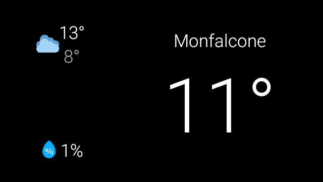
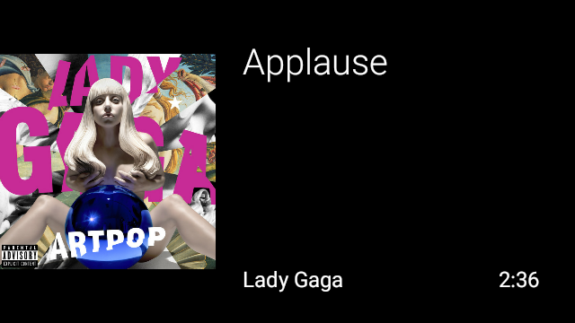

## Giulio's glass apps
this project aims to get back as many Google Glass functionalities as possible

| App | XE | EE2 | state | description |
| - | - | - | - | - |
| youtube | yes | yes | ugly but it works | basic youtube video player using voice recognition so search videos (install original youtube apk to make it work) |
| youtube_explorer | yes | no | done (minor bugs to fix) | youtube adaptation optimized for glass XE |
| weather | yes | no | done (minor bugs to fix) | weather app as live card, uses current location or a custom one |
| maps | yes | yes | initial development | navigation |
| spotify | yes | no | active development | controls (play/pause, next, ...) and maybe player |

Please note that I am not an android developer and my time is limited.

